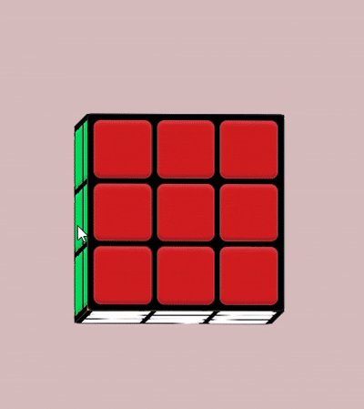

# 🧊 3D Rubik's Cube using HTML & CSS

A fully animated 3D Rubik's Cube created using pure HTML and CSS. This project demonstrates the power of CSS 3D transforms, CSS Grid, and animations without using any JavaScript.



## ✨ Features

* Pure HTML & CSS
* Realistic 3D Cube Effect
* Smooth Infinite Rotation Animation
* CSS Grid Layout for Cube Faces
* Responsive Centered Design
* Lightweight and Easy to Understand

## 📸 Preview

The cube consists of six colored faces:

* 🔴 Front - Red
* 🟠 Back - Orange
* 🔵 Right - Blue
* 🟢 Left - Green
* 🟡 Top - Yellow
* ⚪ Bottom - White

## 🛠 Technologies Used

* HTML5
* CSS3
* CSS Grid
* CSS 3D Transforms
* CSS Animations

## 📂 Project Structure

```text
project/
│
├── cube.html
├── cube.css
└── README.md
```

## 🚀 How to Run

1. Download or clone the repository.

```bash
git clone https://github.com/your-username/3d-rubiks-cube.git
```

2. Open `cube.html` in your browser.

That's it! The cube will automatically start rotating.

## 🎯 Learning Concepts

This project is useful for learning:

* CSS Perspective
* Transform Style Preserve-3D
* RotateX and RotateY
* TranslateZ
* CSS Grid
* Keyframe Animations
* 3D Object Construction

## 📖 Future Improvements

* Add JavaScript controls
* Interactive cube rotation
* Mouse drag support
* Dark mode theme
* Rubik's Cube solving animation

## 👨‍💻 Author

**Rudra Sharma**

